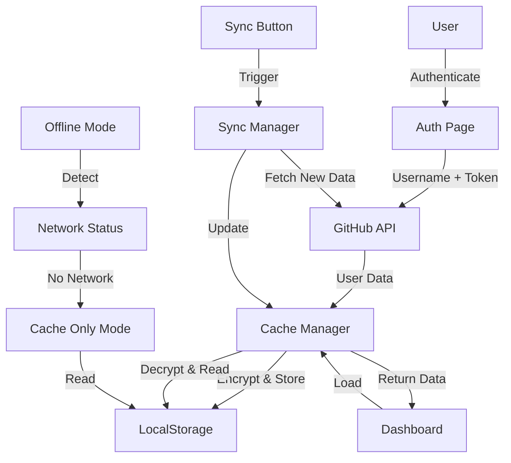

# Design Document - GitHub Activity Tracker

## Overview

Le GitHub Activity Tracker est une application web Next.js 14 qui permet aux développeurs de suivre et analyser leur activité GitHub. L'application utilise l'App Router de Next.js, stocke toutes les données localement dans le navigateur, et offre une interface moderne construite avec shadcn/ui et Tailwind CSS.

L'architecture privilégie la performance avec un système de cache intelligent, le chargement progressif des données, et un mode hors ligne complet. L'application ne nécessite aucun backend - toutes les interactions se font directement entre le navigateur et l'API GitHub.

## Architecture

### Stack Technique

**Framework & Runtime:**
- Next.js 14 (App Router)
- React 18
- TypeScript

**UI & Styling:**
- shadcn/ui (composants)
- Tailwind CSS (styling)
- next-themes (dark/light mode)
- Lucide React (icônes)
- Framer Motion (animations optionnelles)

**Data & State:**
- Zustand (state management global)
- SWR (data fetching & caching)
- date-fns (manipulation de dates)

**Graphiques:**
- Recharts (graphiques et visualisations)

**Sécurité:**
- Web Crypto API (chiffrement du token)

**API:**
- GitHub REST API v3
- Octokit (client GitHub optionnel)

### Architecture de l'Application

```
github-activity-tracker/
├── app/
│   ├── layout.tsx                 # Root layout avec providers
│   ├── page.tsx                   # Dashboard (page d'accueil)
│   ├── projects/
│   │   └── page.tsx              # Liste des projets
│   ├── search/
│   │   └── page.tsx              # Page de recherche
│   ├── settings/
│   │   └── page.tsx              # Paramètres
│   └── auth/
│       └── page.tsx              # Page de connexion
│
├── components/
│   ├── ui/                       # shadcn/ui components
│   ├── dashboard/
│   │   ├── TodayCard.tsx
│   │   ├── WeekCard.tsx
│   │   ├── WeekTimeline.tsx
│   │   └── StatsPanel.tsx
│   ├── projects/
│   │   ├── ProjectCard.tsx
│   │   ├── ProjectModal.tsx
│   │   └── ProjectFilters.tsx
│   ├── search/
│   │   ├── SearchBar.tsx
│   │   └── SearchResults.tsx
│   ├── charts/
│   │   ├── ActivityBarChart.tsx
│   │   ├── HeatmapCalendar.tsx
│   │   └── MiniActivityGraph.tsx
│   └── layout/
│       ├── Sidebar.tsx
│       ├── Header.tsx
│       └── MobileNav.tsx
│
├── lib/
│   ├── github/
│   │   ├── api.ts               # GitHub API calls
│   │   ├── auth.ts              # Authentication logic
│   │   └── types.ts             # GitHub data types
│   ├── storage/
│   │   ├── cache.ts             # LocalStorage management
│   │   ├── crypto.ts            # Token encryption
│   │   └── schema.ts            # Data structure definitions
│   ├── utils/
│   │   ├── calculations.ts      # Stats calculations
│   │   ├── date-helpers.ts      # Date utilities
│   │   └── formatters.ts        # Data formatters
│   └── stores/
│       ├── auth-store.ts        # Auth state (Zustand)
│       ├── activity-store.ts    # Activity data (Zustand)
│       └── settings-store.ts    # User preferences (Zustand)
│
├── hooks/
│   ├── useGitHubData.ts         # Fetch GitHub data
│   ├── useActivityCache.ts      # Cache management
│   ├── useSync.ts               # Data synchronization
│   └── useOfflineMode.ts        # Offline detection
│
└── types/
    ├── activity.ts              # Activity data types
    ├── repository.ts            # Repository types
    └── settings.ts              # Settings types
```

### Flux de Données



## Components and Interfaces

### Core Data Types

```typescript
// types/activity.ts
interface UserProfile {
  username: string;
  avatarUrl: string;
  totalRepos: number;
  memberSince: string;
}

interface Repository {
  id: string;
  name: string;
  fullName: string;
  description: string | null;
  language: string | null;
  stars: number;
  forks: number;
  isPrivate: boolean;
  createdAt: string;
  updatedAt: string;
  lastCommitDate: string | null;
  status: 'active' | 'warm' | 'cold' | 'archived';
}

interface Commit {
  sha: string;
  message: string;
  date: string;
  repoName: string;
  filesChanged: string[];
  additions: number;
  deletions: number;
  url: string;
}

interface WeekActivity {
  weekId: string; // Format: YYYY-WW
  startDate: string;
  endDate: string;
  totalCommits: number;
  reposTouched: string[];
  dailyCommits: number[]; // 7 values (Mon-Sun)
  linesAdded: number;
  linesDeleted: number;
  newRepos: string[];
}

interface CacheMetadata {
  lastSync: string;
  cacheVersion: string;
  totalSize: number;
}

interface ActivityCache {
  userProfile: UserProfile;
  repositories: Repository[];
  commits: Commit[];
  weeksActivity: WeekActivity[];
  metadata: CacheMetadata;
}
```

### GitHub API Service

```typescript
// lib/github/api.ts
interface GitHubAPIConfig {
  username: string;
  token?: string;
}

class GitHubAPI {
  async getUserProfile(username: string): Promise<UserProfile>
  async getRepositories(username: string): Promise<Repository[]>
  async getCommits(repo: string, since?: Date): Promise<Commit[]>
  async getCommitDetails(repo: string, sha: string): Promise<Commit>
  async checkRateLimit(): Promise<RateLimitInfo>
}
```

### Cache Manager

```typescript
// lib/storage/cache.ts
class CacheManager {
  // Lecture
  async getActivityCache(): Promise<ActivityCache | null>
  async getWeekActivity(weekId: string): Promise<WeekActivity | null>
  async getRepositories(): Promise<Repository[]>
  async getCommits(filters?: CommitFilters): Promise<Commit[]>
  
  // Écriture
  async saveActivityCache(data: ActivityCache): Promise<void>
  async updateWeekActivity(weekId: string, data: WeekActivity): Promise<void>
  async addCommits(commits: Commit[]): Promise<void>
  
  // Gestion
  async getCacheSize(): Promise<number>
  async clearCache(): Promise<void>
  async isStale(key: string, maxAge: number): Promise<boolean>
}
```

### Crypto Service

```typescript
// lib/storage/crypto.ts
class CryptoService {
  async encryptToken(token: string): Promise<string>
  async decryptToken(encrypted: string): Promise<string>
  async generateSalt(): Promise<string>
  async deriveKey(salt: string): Promise<CryptoKey>
}
```

### Calculation Utilities

```typescript
// lib/utils/calculations.ts

// Calcul du statut d'un repository
function calculateRepoStatus(lastCommitDate: string): RepositoryStatus {
  const daysSinceLastCommit = differenceInDays(new Date(), new Date(lastCommitDate));
  
  if (daysSinceLastCommit < 7) return 'active';
  if (daysSinceLastCommit < 30) return 'warm';
  if (daysSinceLastCommit < 90) return 'cold';
  return 'archived';
}

// Calcul du streak
function calculateStreak(commits: Commit[]): number {
  const today = startOfDay(new Date());
  let streak = 0;
  let currentDay = today;
  
  while (true) {
    const hasCommit = commits.some(c => 
      isSameDay(new Date(c.date), currentDay)
    );
    
    if (!hasCommit) break;
    
    streak++;
    currentDay = subDays(currentDay, 1);
  }
  
  return streak;
}

// Agrégation de l'activité hebdomadaire
function aggregateWeekActivity(commits: Commit[], weekStart: Date): WeekActivity {
  const weekEnd = addDays(weekStart, 6);
  const weekCommits = commits.filter(c => {
    const date = new Date(c.date);
    return date >= weekStart && date <= weekEnd;
  });
  
  const dailyCommits = Array(7).fill(0);
  weekCommits.forEach(c => {
    const dayIndex = getDay(new Date(c.date));
    dailyCommits[dayIndex]++;
  });
  
  return {
    weekId: format(weekStart, 'yyyy-II'),
    startDate: weekStart.toISOString(),
    endDate: weekEnd.toISOString(),
    totalCommits: weekCommits.length,
    reposTouched: [...new Set(weekCommits.map(c => c.repoName))],
    dailyCommits,
    linesAdded: weekCommits.reduce((sum, c) => sum + c.additions, 0),
    linesDeleted: weekCommits.reduce((sum, c) => sum + c.deletions, 0),
    newRepos: [] // À calculer séparément
  };
}

// Langage le plus utilisé
function getMostUsedLanguage(repos: Repository[]): string | null {
  const languageCounts = repos.reduce((acc, repo) => {
    if (repo.language) {
      acc[repo.language] = (acc[repo.language] || 0) + 1;
    }
    return acc;
  }, {} as Record<string, number>);
  
  const entries = Object.entries(languageCounts);
  if (entries.length === 0) return null;
  
  return entries.reduce((max, [lang, count]) => 
    count > max[1] ? [lang, count] : max
  )[0];
}
```

### Zustand Stores

```typescript
// lib/stores/auth-store.ts
interface AuthState {
  username: string | null;
  token: string | null;
  isAuthenticated: boolean;
  
  setCredentials: (username: string, token?: string) => void;
  clearCredentials: () => void;
  loadFromCache: () => Promise<void>;
}

// lib/stores/activity-store.ts
interface ActivityState {
  userProfile: UserProfile | null;
  repositories: Repository[];
  commits: Commit[];
  weeksActivity: WeekActivity[];
  isLoading: boolean;
  lastSync: Date | null;
  
  loadFromCache: () => Promise<void>;
  syncWithGitHub: () => Promise<void>;
  addCommits: (commits: Commit[]) => void;
  updateRepository: (id: string, data: Partial<Repository>) => void;
}

// lib/stores/settings-store.ts
interface SettingsState {
  theme: 'light' | 'dark' | 'auto';
  dateFormat: 'eu' | 'us' | 'relative';
  weeksToDisplay: number;
  language: 'fr' | 'en';
  offlineMode: boolean;
  
  updateSettings: (settings: Partial<SettingsState>) => void;
  loadFromCache: () => void;
}
```

### Custom Hooks

```typescript
// hooks/useGitHubData.ts
function useGitHubData(username: string) {
  const { data, error, isLoading, mutate } = useSWR(
    username ? `/api/github/${username}` : null,
    () => fetchGitHubData(username),
    {
      revalidateOnFocus: false,
      dedupingInterval: 3600000, // 1 hour
    }
  );
  
  return {
    profile: data?.profile,
    repositories: data?.repositories,
    commits: data?.commits,
    isLoading,
    error,
    refresh: mutate
  };
}

// hooks/useSync.ts
function useSync() {
  const [isSyncing, setIsSyncing] = useState(false);
  const [lastSync, setLastSync] = useState<Date | null>(null);
  
  const sync = async () => {
    setIsSyncing(true);
    try {
      // Fetch new data from GitHub
      // Update cache
      // Update stores
      setLastSync(new Date());
    } finally {
      setIsSyncing(false);
    }
  };
  
  return { sync, isSyncing, lastSync };
}

// hooks/useOfflineMode.ts
function useOfflineMode() {
  const [isOnline, setIsOnline] = useState(true);
  
  useEffect(() => {
    const handleOnline = () => setIsOnline(true);
    const handleOffline = () => setIsOnline(false);
    
    window.addEventListener('online', handleOnline);
    window.addEventListener('offline', handleOffline);
    
    return () => {
      window.removeEventListener('online', handleOnline);
      window.removeEventListener('offline', handleOffline);
    };
  }, []);
  
  return { isOnline, isOffline: !isOnline };
}
```

### Key Components

```typescript
// components/dashboard/WeekCard.tsx
interface WeekCardProps {
  weekActivity: WeekActivity;
  onDetailsClick: () => void;
}

// components/projects/ProjectCard.tsx
interface ProjectCardProps {
  repository: Repository;
  activityData: number[]; // 30 days
  onCardClick: () => void;
}

// components/charts/ActivityBarChart.tsx
interface ActivityBarChartProps {
  data: { day: string; commits: number }[];
  height?: number;
}

// components/search/SearchBar.tsx
interface SearchBarProps {
  onSearch: (query: string, filters: SearchFilters) => void;
  placeholder?: string;
}
```

## Data Models

### LocalStorage Schema

```typescript
// Structure dans LocalStorage
{
  "github-tracker-user-profile": {
    username: string,
    avatarUrl: string,
    totalRepos: number,
    memberSince: string
  },
  
  "github-tracker-repositories": Repository[],
  
  "github-tracker-commits": Commit[],
  
  "github-tracker-weeks": {
    [weekId: string]: WeekActivity
  },
  
  "github-tracker-metadata": {
    lastSync: string,
    cacheVersion: string,
    totalSize: number
  },
  
  "github-tracker-auth": {
    username: string,
    encryptedToken: string,
    salt: string
  },
  
  "github-tracker-settings": {
    theme: string,
    dateFormat: string,
    weeksToDisplay: number,
    language: string,
    offlineMode: boolean
  }
}
```

### Data Flow Patterns

**Initial Load:**
1. User authenticates → Store encrypted token
2. Fetch user profile → Cache
3. Fetch all repositories → Cache
4. For each repo, fetch commits (last 6 months) → Cache
5. Calculate week activities → Cache
6. Calculate statistics → Display

**Incremental Sync:**
1. Check last sync date
2. Fetch only new commits since last sync
3. Update affected week activities
4. Recalculate statistics
5. Update cache

**Search:**
1. Load commits from cache
2. Filter by search query (case-insensitive)
3. Apply additional filters (date, repo, language)
4. Sort by relevance then date
5. Return paginated results

## Correctness Properties

*A property is a characteristic or behavior that should hold true across all valid executions of a system—essentially, a formal statement about what the system should do. Properties serve as the bridge between human-readable specifications and machine-verifiable correctness guarantees.*


### Property 1: Token Encryption Round-Trip

*For any* valid GitHub token string, encrypting then decrypting the token should produce the original token value.

**Validates: Requirements 1.5, 12.1**

### Property 2: Repository Status Calculation

*For any* repository with a last commit date, the calculated status should match the defined rules: active if < 7 days, warm if 7-30 days, cold if 30-90 days, archived if > 90 days.

**Validates: Requirements 4.2, 4.3, 4.4, 4.5**

### Property 3: Week Activity Aggregation

*For any* set of commits and a week start date, aggregating the commits should produce a WeekActivity with correct total commits, daily breakdown (7 values), and touched repositories list.

**Validates: Requirements 2.4**

### Property 4: Streak Calculation

*For any* chronologically ordered list of commits, the calculated streak should equal the number of consecutive days with at least one commit, starting from today and counting backwards until the first day without commits.

**Validates: Requirements 16.1, 16.2, 16.3**

### Property 5: Repository Filtering

*For any* repository list and status filter value, all filtered results should have a status matching the filter value.

**Validates: Requirements 4.6**

### Property 6: Language Filtering

*For any* repository list and language filter value, all filtered results should have that language as their primary language.

**Validates: Requirements 4.7**

### Property 7: Search Query Matching

*For any* search query string and data collection (commits, repositories, files), all search results should contain the query string in at least one searchable field (message, name, description, filename).

**Validates: Requirements 6.1, 6.2**

### Property 8: Search Result Sorting

*For any* search results with relevance scores and dates, the results should be sorted first by relevance (descending) then by date (descending) for equal relevance scores.

**Validates: Requirements 6.6**

### Property 9: Cache Data Round-Trip

*For any* ActivityCache object, saving it to LocalStorage then loading it back should produce an equivalent object with all fields intact.

**Validates: Requirements 2.5**

### Property 10: Commit Date Filtering

*For any* commit list and date range (start, end), all filtered commits should have dates within the specified range (inclusive).

**Validates: Requirements 2.3, 11.7**

### Property 11: Weekly Report Generation

*For any* WeekActivity data, generating a Markdown report should produce a valid Markdown document containing all required sections: overview stats, projects list, daily breakdown, and highlights.

**Validates: Requirements 8.1, 8.2**

### Property 12: Monthly Report Aggregation

*For any* set of WeekActivity objects spanning a month, generating a monthly report should correctly aggregate commits by week and calculate month totals.

**Validates: Requirements 8.3**

### Property 13: Data Export Completeness

*For any* complete ActivityCache, exporting to JSON should include all required fields: userProfile, repositories, commits, weeksActivity, and metadata.

**Validates: Requirements 15.1, 15.2**

### Property 14: JSON Export Round-Trip

*For any* ActivityCache object, exporting to JSON then parsing back should produce an equivalent object.

**Validates: Requirements 9.6, 15.1**

### Property 15: Cache Size Limit

*For any* cache operation, if the resulting cache size would exceed 50 MB, the system should reject the operation or trim old data to stay within the limit.

**Validates: Requirements 11.5**

### Property 16: Repository Display Limit

*For any* repository list rendering, the number of simultaneously displayed repositories should not exceed 100.

**Validates: Requirements 11.6**

### Property 17: Incremental Sync

*For any* sync operation with a last sync date, only commits with dates after the last sync date should be fetched from the API.

**Validates: Requirements 7.4**

### Property 18: Cache Staleness Check

*For any* cached week data, if the week is in the past (not current week), it should never be marked as stale regardless of age.

**Validates: Requirements 7.6**

### Property 19: Current Week Cache Expiration

*For any* cached current week data, it should be marked as stale if more than 1 hour has passed since caching.

**Validates: Requirements 7.5**

### Property 20: Commit Grouping by Week

*For any* list of commits, grouping by week should place each commit in exactly one week group, and all commits in a group should have dates within that week's range.

**Validates: Requirements 5.3**

### Property 21: Date Format Consistency

*For any* date value and selected date format setting (EU, US, Relative), all displayed dates should use the selected format consistently throughout the application.

**Validates: Requirements 9.3**

### Property 22: Search Multi-Filter Application

*For any* search query with multiple filters (date range, project, language), all results should satisfy ALL filter conditions simultaneously.

**Validates: Requirements 6.4**

### Property 23: Encryption Key Derivation Uniqueness

*For any* two different salt values, deriving encryption keys from them should produce different keys.

**Validates: Requirements 12.2**

### Property 24: Data Deletion Completeness

*For any* data deletion operation, after completion, LocalStorage should contain no keys starting with "github-tracker-".

**Validates: Requirements 12.7, 12.8**

### Property 25: Repository Card Content Completeness

*For any* repository, rendering its card should produce output containing all required fields: name, status badge, language, description, last activity date, last commit message, and statistics.

**Validates: Requirements 4.9**

### Property 26: Week Card Content Completeness

*For any* WeekActivity, rendering its card should produce output containing dates, activity graph data, total commits, and project list.

**Validates: Requirements 3.4**

### Property 27: Commit Display Content Completeness

*For any* commit, rendering it should produce output containing date, time, message, and files changed.

**Validates: Requirements 5.4**

### Property 28: Search Result Content Completeness

*For any* search result, rendering it should produce output containing result type, title, project name, date, and context.

**Validates: Requirements 6.3**

### Property 29: Most Used Language Calculation

*For any* repository list, the calculated most used language should be the language that appears most frequently across all repositories.

**Validates: Requirements 3.5**

### Property 30: Offline Mode Data Access

*For any* cached data and offline mode enabled, all navigation and data access operations should succeed using only cached data without network requests.

**Validates: Requirements 10.4**

### Property 31: Repository Count Accuracy

*For any* user, the total repository count should equal the number of repositories fetched from the GitHub API.

**Validates: Requirements 2.2**

### Property 32: Dashboard Statistics Calculation

*For any* activity data, the displayed global statistics (total projects, total commits, most active project, current streak) should be correctly calculated from the cached data.

**Validates: Requirements 3.5**

### Property 33: Weeks Display Configuration

*For any* weeks display setting value between 4 and 24, the timeline should display exactly that number of week cards.

**Validates: Requirements 9.5**

### Property 34: Streak Update After Sync

*For any* sync operation that adds new commits, the streak value should be recalculated and updated to reflect the new data.

**Validates: Requirements 16.5**

## Error Handling

### Error Types and Responses

**Network Errors:**
- Display user-friendly message: "Impossible de se connecter à GitHub"
- Offer options: "Utiliser les données en cache" or "Réessayer"
- Automatically switch to offline mode if persistent
- Log technical details to console for debugging

**Authentication Errors:**
- Invalid username (404): "Utilisateur GitHub introuvable"
- Invalid/expired token (401): "Ton token a expiré" → redirect to settings
- Missing token for private repos: Warning message explaining limited access

**Rate Limit Errors:**
- Detect X-RateLimit-Remaining header
- Display: "Limite API atteinte (5000 requêtes/heure)"
- Show countdown: "Réinitialisé dans X minutes"
- Offer cache-only mode
- Prevent further API calls until reset

**Data Errors:**
- Corrupted cache: Clear and re-fetch
- Invalid JSON: Display error and offer to reset
- Missing required fields: Use defaults and log warning

**Storage Errors:**
- LocalStorage full: Offer to clear old data
- LocalStorage unavailable: Display error, app cannot function
- Encryption failure: Clear credentials and re-authenticate

### Error Recovery Strategies

```typescript
// lib/utils/error-handler.ts
class ErrorHandler {
  handleGitHubAPIError(error: GitHubAPIError): ErrorResponse {
    if (error.status === 404) {
      return {
        type: 'user-not-found',
        message: 'Utilisateur GitHub introuvable',
        action: 'retry',
        severity: 'error'
      };
    }
    
    if (error.status === 401) {
      return {
        type: 'auth-failed',
        message: 'Token invalide ou expiré',
        action: 'redirect-settings',
        severity: 'error'
      };
    }
    
    if (error.status === 403 && error.headers['x-ratelimit-remaining'] === '0') {
      const resetTime = error.headers['x-ratelimit-reset'];
      return {
        type: 'rate-limit',
        message: 'Limite API atteinte',
        action: 'cache-only',
        severity: 'warning',
        metadata: { resetTime }
      };
    }
    
    return {
      type: 'network-error',
      message: 'Erreur de connexion',
      action: 'retry-or-cache',
      severity: 'error'
    };
  }
  
  handleStorageError(error: Error): ErrorResponse {
    if (error.name === 'QuotaExceededError') {
      return {
        type: 'storage-full',
        message: 'Espace de stockage insuffisant',
        action: 'clear-cache',
        severity: 'warning'
      };
    }
    
    return {
      type: 'storage-error',
      message: 'Erreur de stockage local',
      action: 'reset-app',
      severity: 'error'
    };
  }
}
```

## Testing Strategy

### Dual Testing Approach

This application requires both unit tests and property-based tests to ensure correctness:

**Unit Tests** focus on:
- Specific examples and edge cases
- UI component rendering
- Error handling scenarios
- Integration between components
- User interactions and events

**Property-Based Tests** focus on:
- Universal properties that hold for all inputs
- Data transformations and calculations
- Round-trip properties (encryption, serialization)
- Filtering and sorting logic
- Statistical calculations

Both testing approaches are complementary and necessary for comprehensive coverage.

### Testing Framework

**Framework:** Vitest (fast, modern, TypeScript-first)

**Property-Based Testing Library:** fast-check

**Component Testing:** React Testing Library

**E2E Testing (optional):** Playwright

### Property Test Configuration

Each property-based test must:
- Run minimum 100 iterations (due to randomization)
- Reference its design document property number
- Use the tag format: `Feature: github-activity-tracker, Property {number}: {property_text}`

Example:
```typescript
// lib/utils/calculations.test.ts
import fc from 'fast-check';

describe('Feature: github-activity-tracker, Property 4: Streak Calculation', () => {
  it('should calculate correct streak from any commit list', () => {
    fc.assert(
      fc.property(
        fc.array(fc.date()),
        (dates) => {
          const commits = dates.map(date => ({ date: date.toISOString() }));
          const streak = calculateStreak(commits);
          
          // Verify streak is correct
          // ... assertions
        }
      ),
      { numRuns: 100 }
    );
  });
});
```

### Unit Test Examples

```typescript
// components/dashboard/WeekCard.test.tsx
describe('WeekCard Component', () => {
  it('should display all required information', () => {
    const weekActivity = {
      weekId: '2024-52',
      startDate: '2024-12-23',
      endDate: '2024-12-29',
      totalCommits: 15,
      reposTouched: ['repo1', 'repo2'],
      dailyCommits: [2, 3, 5, 2, 3, 0, 0],
      linesAdded: 500,
      linesDeleted: 200,
      newRepos: []
    };
    
    render(<WeekCard weekActivity={weekActivity} onDetailsClick={() => {}} />);
    
    expect(screen.getByText(/Lun 23 - Dim 29 Déc 2024/)).toBeInTheDocument();
    expect(screen.getByText('15')).toBeInTheDocument(); // total commits
    expect(screen.getByText('repo1')).toBeInTheDocument();
    expect(screen.getByText('repo2')).toBeInTheDocument();
  });
  
  it('should call onDetailsClick when button is clicked', () => {
    const handleClick = vi.fn();
    render(<WeekCard weekActivity={mockWeekActivity} onDetailsClick={handleClick} />);
    
    fireEvent.click(screen.getByText('Voir détails'));
    expect(handleClick).toHaveBeenCalledTimes(1);
  });
});

// lib/storage/crypto.test.ts
describe('CryptoService', () => {
  it('should handle encryption errors gracefully', async () => {
    const crypto = new CryptoService();
    
    await expect(crypto.encryptToken('')).rejects.toThrow();
  });
  
  it('should generate unique salts', async () => {
    const crypto = new CryptoService();
    
    const salt1 = await crypto.generateSalt();
    const salt2 = await crypto.generateSalt();
    
    expect(salt1).not.toBe(salt2);
  });
});
```

### Test Coverage Goals

- Core calculation functions: 100%
- Data transformation functions: 100%
- React components: 80%
- Error handlers: 90%
- API integration: 70% (mocked)

### Testing Best Practices

1. **Avoid over-mocking**: Test real functionality when possible
2. **Use property tests for calculations**: They catch edge cases unit tests miss
3. **Test user workflows**: Not just individual functions
4. **Test error states**: Ensure graceful degradation
5. **Test responsive behavior**: Verify layouts at different breakpoints
6. **Test accessibility**: Ensure keyboard navigation and screen readers work

### Continuous Testing

- Run tests on every commit (pre-commit hook)
- Run full test suite in CI/CD pipeline
- Monitor test execution time (keep under 30 seconds)
- Fail builds on test failures
- Track test coverage trends

## Performance Considerations

### Optimization Strategies

**Data Loading:**
- Implement virtual scrolling for long lists (react-window)
- Lazy load week data on scroll
- Prefetch next week data in background
- Use React.memo for expensive components
- Debounce search input (300ms)

**Caching:**
- Use SWR for automatic cache revalidation
- Implement stale-while-revalidate pattern
- Cache API responses with ETags
- Compress large data before storing
- Implement cache eviction for old data

**Rendering:**
- Use React Server Components where possible
- Implement code splitting by route
- Lazy load chart libraries
- Use CSS containment for cards
- Optimize images (use Next.js Image component)

**Bundle Size:**
- Tree-shake unused code
- Use dynamic imports for heavy components
- Analyze bundle with @next/bundle-analyzer
- Keep initial bundle under 200KB

### Performance Metrics

Target metrics:
- First Contentful Paint: < 1.5s
- Time to Interactive: < 3s
- Largest Contentful Paint: < 2.5s
- Cumulative Layout Shift: < 0.1
- First Input Delay: < 100ms

## Security Considerations

### Token Security

**Storage:**
- Never store token in plain text
- Use Web Crypto API for encryption
- Derive key from unique salt per user
- Store encrypted token in LocalStorage
- Clear token on logout

**Transmission:**
- Only send token to api.github.com
- Use HTTPS exclusively
- Include token in Authorization header
- Never log token values
- Never expose token in URLs

**Validation:**
- Validate token format before use
- Handle expired tokens gracefully
- Prompt for re-authentication on 401
- Clear invalid tokens immediately

### Data Privacy

**Principles:**
- No server-side storage
- No third-party analytics
- No cookies (except essential)
- No tracking scripts
- User owns all data

**User Control:**
- Export all data anytime
- Delete all data anytime
- Clear cache anytime
- Revoke token anytime

### Content Security Policy

```typescript
// next.config.js
const securityHeaders = [
  {
    key: 'Content-Security-Policy',
    value: `
      default-src 'self';
      script-src 'self' 'unsafe-eval' 'unsafe-inline';
      style-src 'self' 'unsafe-inline';
      img-src 'self' data: https://avatars.githubusercontent.com;
      connect-src 'self' https://api.github.com;
      font-src 'self';
    `.replace(/\s{2,}/g, ' ').trim()
  },
  {
    key: 'X-Frame-Options',
    value: 'DENY'
  },
  {
    key: 'X-Content-Type-Options',
    value: 'nosniff'
  },
  {
    key: 'Referrer-Policy',
    value: 'strict-origin-when-cross-origin'
  }
];
```

## Deployment

### Build Configuration

```typescript
// next.config.js
const nextConfig = {
  output: 'export', // Static export for client-only app
  images: {
    unoptimized: true // Required for static export
  },
  trailingSlash: true,
  reactStrictMode: true,
  swcMinify: true,
};
```

### Hosting Options

**Recommended: Vercel**
- Zero-config deployment
- Automatic HTTPS
- Edge network CDN
- Preview deployments
- Free tier available

**Alternatives:**
- Netlify (similar to Vercel)
- GitHub Pages (free, static hosting)
- Cloudflare Pages (fast, global CDN)
- AWS S3 + CloudFront (scalable)

### Environment Variables

```bash
# .env.local (not committed)
NEXT_PUBLIC_APP_VERSION=1.0.0
NEXT_PUBLIC_GITHUB_API_URL=https://api.github.com
```

### Deployment Checklist

- [ ] Run full test suite
- [ ] Build production bundle
- [ ] Verify bundle size
- [ ] Test in production mode locally
- [ ] Check all environment variables
- [ ] Verify CSP headers
- [ ] Test on multiple browsers
- [ ] Test responsive layouts
- [ ] Verify offline mode works
- [ ] Check error handling
- [ ] Deploy to staging
- [ ] Run smoke tests
- [ ] Deploy to production

## Future Enhancements

### Phase 2 Features

**Advanced Statistics:**
- Contribution heatmap (GitHub-style)
- Language usage over time
- Commit time patterns
- Code churn analysis
- Productivity trends

**Collaboration:**
- View team activity
- Compare with teammates
- Shared dashboards
- Team reports

**Gamification:**
- Achievement badges
- Streak challenges
- Leaderboards
- Progress goals

### Phase 3 Features

**Integrations:**
- GitLab support
- Bitbucket support
- Jira integration
- Slack notifications

**Advanced Reports:**
- PDF export
- Email reports
- Custom templates
- Scheduled reports

**AI Features:**
- Commit message analysis
- Productivity insights
- Anomaly detection
- Recommendations

## Conclusion

This design provides a comprehensive blueprint for building the GitHub Activity Tracker. The architecture prioritizes:

1. **User Privacy**: All data stays local, no server required
2. **Performance**: Smart caching and progressive loading
3. **Reliability**: Offline mode and error recovery
4. **Correctness**: Property-based testing ensures quality
5. **Maintainability**: Clean architecture and TypeScript

The MVP can be built in 1-2 weeks, with clear paths for future enhancements. The use of modern tools (Next.js 14, shadcn/ui, Tailwind) ensures a great developer experience and a polished user interface.
