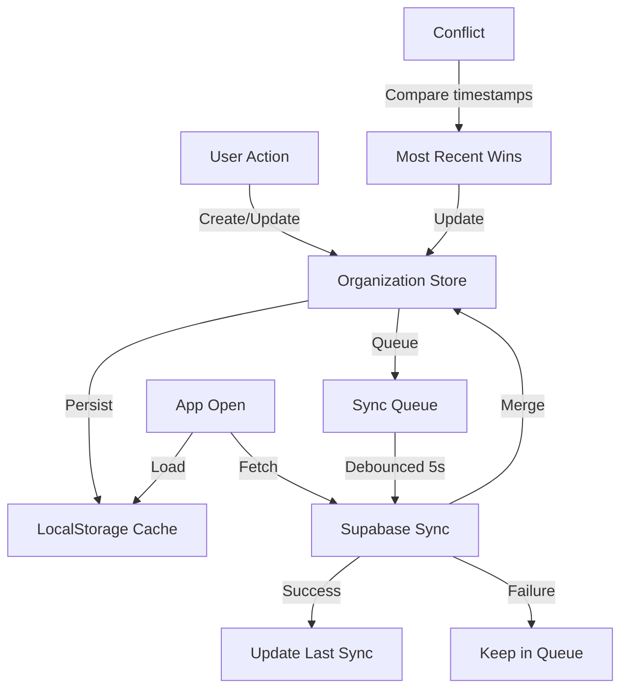

# Design Document - Project Organization

## Overview

Cette extension ajoute des fonctionnalités d'organisation et de productivité au GitHub Activity Tracker existant. Elle permet aux utilisateurs de catégoriser leurs projets avec des tags personnalisés, de marquer des favoris, d'ajouter des notes et des TODO lists, et de définir des statuts manuels. Toutes ces données sont synchronisées via Supabase pour une utilisation multi-machines.

L'architecture s'intègre à l'application existante en étendant les types, les stores Zustand, et le cache LocalStorage. La synchronisation Supabase utilise le client déjà configuré.

## Architecture

### Extension du Stack Existant

**Nouvelles dépendances:**
- `uuid` - Génération de Machine_ID
- `@dnd-kit/core` - Drag and drop pour les TODO items

**Services existants utilisés:**
- Supabase (déjà configuré)
- Zustand stores
- LocalStorage cache

### Structure des Nouveaux Fichiers

```
src/
├── types/
│   └── organization.ts          # Nouveaux types pour l'organisation
│
├── lib/
│   ├── storage/
│   │   └── organization-cache.ts # Cache LocalStorage pour organisation
│   │
│   ├── stores/
│   │   └── organization-store.ts # Zustand store pour organisation
│   │
│   ├── supabase/
│   │   └── organization.ts       # Sync Supabase pour organisation
│   │
│   └── utils/
│       └── organization.ts       # Utilitaires (tri, filtres, etc.)
│
├── components/
│   ├── organization/
│   │   ├── tag-badge.tsx         # Badge de tag coloré
│   │   ├── tag-selector.tsx      # Sélecteur de tags
│   │   ├── tag-manager.tsx       # Gestion des tags (settings)
│   │   ├── note-editor.tsx       # Éditeur de notes Markdown
│   │   ├── todo-list.tsx         # Liste de TODO items
│   │   ├── todo-item.tsx         # Item TODO individuel
│   │   ├── status-selector.tsx   # Sélecteur de statut manuel
│   │   ├── clone-status.tsx      # Indicateur de clone local
│   │   └── sync-indicator.tsx    # Indicateur de sync
│   │
│   └── projects/
│       └── project-card.tsx      # Mise à jour avec organisation
│       └── project-modal.tsx     # Mise à jour avec notes/TODOs
│       └── project-filters.tsx   # Mise à jour avec filtres org
```

### Flux de Données



## Components and Interfaces

### Core Data Types

```typescript
// types/organization.ts

/**
 * Custom tag for categorizing projects
 */
export interface Tag {
  id: string           // UUID
  name: string         // Display name (unique, non-empty)
  color: string        // Hex color code
  createdAt: string    // ISO date
  updatedAt: string    // ISO date
}

/**
 * Default tags provided on first use
 */
export const DEFAULT_TAGS: Omit<Tag, 'id' | 'createdAt' | 'updatedAt'>[] = [
  { name: 'client', color: '#3B82F6' },      // Blue
  { name: 'perso', color: '#10B981' },       // Green
  { name: 'side-project', color: '#8B5CF6' }, // Purple
  { name: 'à finir', color: '#F59E0B' },     // Amber
]

/**
 * Manual status options for projects
 */
export type ManualStatus = 'en-cours' | 'en-pause' | 'termine' | 'abandonne'

export const MANUAL_STATUS_LABELS: Record<ManualStatus, string> = {
  'en-cours': 'En cours',
  'en-pause': 'En pause',
  'termine': 'Terminé',
  'abandonne': 'Abandonné',
}

export const MANUAL_STATUS_COLORS: Record<ManualStatus, string> = {
  'en-cours': '#22C55E',   // Green
  'en-pause': '#F59E0B',   // Amber
  'termine': '#3B82F6',    // Blue
  'abandonne': '#6B7280',  // Gray
}

/**
 * TODO item for a project
 */
export interface TodoItem {
  id: string           // UUID
  projectId: number    // Repository ID
  description: string  // Non-empty text
  completed: boolean
  order: number        // For drag & drop reordering
  createdAt: string    // ISO date
  updatedAt: string    // ISO date
}

/**
 * Note attached to a project
 */
export interface ProjectNote {
  projectId: number    // Repository ID
  content: string      // Markdown content (max 10,000 chars)
  createdAt: string    // ISO date
  updatedAt: string    // ISO date
}

/**
 * Organization metadata for a project
 */
export interface ProjectOrganization {
  projectId: number
  tagIds: string[]           // Assigned tag IDs
  isFavorite: boolean
  isPinned: boolean
  manualStatus: ManualStatus | null
  manualStatusDate: string | null  // When status was set
  clonedOnMachines: string[]       // Machine IDs where cloned
}

/**
 * Machine identification
 */
export interface MachineInfo {
  id: string           // UUID, unique per browser
  name: string         // User-friendly name (optional)
  createdAt: string    // ISO date
  lastSeenAt: string   // ISO date
}

/**
 * Sync queue item for offline support
 */
export interface SyncQueueItem {
  id: string
  type: 'tag' | 'project-org' | 'note' | 'todo' | 'machine'
  action: 'create' | 'update' | 'delete'
  data: unknown
  timestamp: string    // ISO date
  retryCount: number
}

/**
 * Complete organization data structure
 */
export interface OrganizationData {
  tags: Tag[]
  projectOrganizations: Record<number, ProjectOrganization>
  notes: Record<number, ProjectNote>
  todos: TodoItem[]
  machineInfo: MachineInfo
  syncQueue: SyncQueueItem[]
  lastSyncAt: string | null
}

/**
 * Limits for organization data
 */
export const ORGANIZATION_LIMITS = {
  MAX_TAGS: 50,
  MAX_TODOS_PER_PROJECT: 50,
  MAX_TODOS_TOTAL: 500,
  MAX_NOTE_LENGTH: 10000,
  MAX_NOTES_SIZE: 1024 * 1024, // 1 MB
  MAX_PINNED_PROJECTS: 5,
}
```

### Organization Store

```typescript
// lib/stores/organization-store.ts

interface OrganizationState {
  // Data
  tags: Tag[]
  projectOrganizations: Record<number, ProjectOrganization>
  notes: Record<number, ProjectNote>
  todos: TodoItem[]
  machineInfo: MachineInfo | null
  
  // Sync state
  syncQueue: SyncQueueItem[]
  lastSyncAt: string | null
  isSyncing: boolean
  syncError: string | null
  
  // Tag actions
  createTag: (name: string, color: string) => Tag | null
  updateTag: (id: string, updates: Partial<Tag>) => void
  deleteTag: (id: string) => void
  
  // Project organization actions
  assignTag: (projectId: number, tagId: string) => void
  removeTag: (projectId: number, tagId: string) => void
  toggleFavorite: (projectId: number) => void
  togglePin: (projectId: number) => boolean // Returns false if limit reached
  setManualStatus: (projectId: number, status: ManualStatus | null) => void
  toggleCloneStatus: (projectId: number) => void
  
  // Note actions
  saveNote: (projectId: number, content: string) => void
  deleteNote: (projectId: number) => void
  
  // TODO actions
  addTodo: (projectId: number, description: string) => TodoItem | null
  toggleTodo: (todoId: string) => void
  deleteTodo: (todoId: string) => void
  reorderTodos: (projectId: number, todoIds: string[]) => void
  clearCompletedTodos: (projectId: number) => void
  
  // Sync actions
  loadFromCache: () => void
  syncWithSupabase: () => Promise<void>
  processQueue: () => Promise<void>
  
  // Utilities
  getProjectOrganization: (projectId: number) => ProjectOrganization
  getProjectTodos: (projectId: number) => TodoItem[]
  getIncompleteTodoCount: (projectId: number) => number
}
```

### Organization Cache

```typescript
// lib/storage/organization-cache.ts

const CACHE_KEYS = {
  TAGS: 'github-tracker-org-tags',
  PROJECT_ORG: 'github-tracker-org-projects',
  NOTES: 'github-tracker-org-notes',
  TODOS: 'github-tracker-org-todos',
  MACHINE: 'github-tracker-org-machine',
  SYNC_QUEUE: 'github-tracker-org-sync-queue',
  LAST_SYNC: 'github-tracker-org-last-sync',
}

// CRUD functions for each data type
export function getTags(): Tag[]
export function saveTags(tags: Tag[]): void

export function getProjectOrganizations(): Record<number, ProjectOrganization>
export function saveProjectOrganizations(data: Record<number, ProjectOrganization>): void

export function getNotes(): Record<number, ProjectNote>
export function saveNotes(notes: Record<number, ProjectNote>): void

export function getTodos(): TodoItem[]
export function saveTodos(todos: TodoItem[]): void

export function getMachineInfo(): MachineInfo | null
export function saveMachineInfo(info: MachineInfo): void
export function getOrCreateMachineId(): string

export function getSyncQueue(): SyncQueueItem[]
export function saveSyncQueue(queue: SyncQueueItem[]): void
export function addToSyncQueue(item: Omit<SyncQueueItem, 'id' | 'timestamp' | 'retryCount'>): void

export function getLastSyncAt(): string | null
export function saveLastSyncAt(date: string): void

// Migration
export function migrateOrganizationData(): void
export function initializeDefaultTags(): void
```

### Supabase Organization Sync

```typescript
// lib/supabase/organization.ts

// Supabase table schemas (to be created)
/*
CREATE TABLE organization_tags (
  id UUID PRIMARY KEY,
  owner TEXT NOT NULL,
  name TEXT NOT NULL,
  color TEXT NOT NULL,
  created_at TIMESTAMPTZ DEFAULT NOW(),
  updated_at TIMESTAMPTZ DEFAULT NOW(),
  UNIQUE(owner, name)
);

CREATE TABLE project_organizations (
  id SERIAL PRIMARY KEY,
  owner TEXT NOT NULL,
  project_id BIGINT NOT NULL,
  tag_ids TEXT[] DEFAULT '{}',
  is_favorite BOOLEAN DEFAULT FALSE,
  is_pinned BOOLEAN DEFAULT FALSE,
  manual_status TEXT,
  manual_status_date TIMESTAMPTZ,
  cloned_on_machines TEXT[] DEFAULT '{}',
  updated_at TIMESTAMPTZ DEFAULT NOW(),
  UNIQUE(owner, project_id)
);

CREATE TABLE project_notes (
  id SERIAL PRIMARY KEY,
  owner TEXT NOT NULL,
  project_id BIGINT NOT NULL,
  content TEXT NOT NULL,
  created_at TIMESTAMPTZ DEFAULT NOW(),
  updated_at TIMESTAMPTZ DEFAULT NOW(),
  UNIQUE(owner, project_id)
);

CREATE TABLE project_todos (
  id UUID PRIMARY KEY,
  owner TEXT NOT NULL,
  project_id BIGINT NOT NULL,
  description TEXT NOT NULL,
  completed BOOLEAN DEFAULT FALSE,
  "order" INTEGER NOT NULL,
  created_at TIMESTAMPTZ DEFAULT NOW(),
  updated_at TIMESTAMPTZ DEFAULT NOW()
);

CREATE TABLE user_machines (
  id UUID PRIMARY KEY,
  owner TEXT NOT NULL,
  name TEXT,
  created_at TIMESTAMPTZ DEFAULT NOW(),
  last_seen_at TIMESTAMPTZ DEFAULT NOW()
);
*/

export async function fetchOrganizationData(owner: string): Promise<OrganizationData>
export async function syncTags(owner: string, tags: Tag[]): Promise<void>
export async function syncProjectOrganization(owner: string, projectId: number, data: ProjectOrganization): Promise<void>
export async function syncNote(owner: string, projectId: number, note: ProjectNote | null): Promise<void>
export async function syncTodos(owner: string, todos: TodoItem[]): Promise<void>
export async function syncMachine(owner: string, machine: MachineInfo): Promise<void>
export async function deleteTag(owner: string, tagId: string): Promise<void>
export async function deleteTodo(owner: string, todoId: string): Promise<void>

// Conflict resolution
export function resolveConflict<T extends { updatedAt: string }>(local: T, remote: T): T {
  return new Date(local.updatedAt) > new Date(remote.updatedAt) ? local : remote
}
```

### Utility Functions

```typescript
// lib/utils/organization.ts

import type { Repository, ProjectOrganization, TodoItem, ManualStatus } from '@/types'

/**
 * Sort projects by organization: pinned first, then favorites, then others
 */
export function sortProjectsByOrganization(
  projects: Repository[],
  organizations: Record<number, ProjectOrganization>
): Repository[] {
  return [...projects].sort((a, b) => {
    const orgA = organizations[a.id] || { isPinned: false, isFavorite: false }
    const orgB = organizations[b.id] || { isPinned: false, isFavorite: false }
    
    // Pinned first
    if (orgA.isPinned && !orgB.isPinned) return -1
    if (!orgA.isPinned && orgB.isPinned) return 1
    
    // Then favorites
    if (orgA.isFavorite && !orgB.isFavorite) return -1
    if (!orgA.isFavorite && orgB.isFavorite) return 1
    
    // Then by last activity (existing sort)
    return 0
  })
}

/**
 * Filter projects by tags
 */
export function filterProjectsByTags(
  projects: Repository[],
  organizations: Record<number, ProjectOrganization>,
  tagIds: string[]
): Repository[] {
  if (tagIds.length === 0) return projects
  return projects.filter(p => {
    const org = organizations[p.id]
    if (!org) return false
    return tagIds.some(tagId => org.tagIds.includes(tagId))
  })
}

/**
 * Filter projects by manual status
 */
export function filterProjectsByStatus(
  projects: Repository[],
  organizations: Record<number, ProjectOrganization>,
  status: ManualStatus
): Repository[] {
  return projects.filter(p => {
    const org = organizations[p.id]
    return org?.manualStatus === status
  })
}

/**
 * Filter projects by clone status
 */
export function filterProjectsByCloneStatus(
  projects: Repository[],
  organizations: Record<number, ProjectOrganization>,
  machineId: string,
  isCloned: boolean
): Repository[] {
  return projects.filter(p => {
    const org = organizations[p.id]
    const cloned = org?.clonedOnMachines.includes(machineId) ?? false
    return cloned === isCloned
  })
}

/**
 * Sort TODOs: incomplete first (by order), then completed (by order)
 */
export function sortTodos(todos: TodoItem[]): TodoItem[] {
  const incomplete = todos.filter(t => !t.completed).sort((a, b) => a.order - b.order)
  const completed = todos.filter(t => t.completed).sort((a, b) => a.order - b.order)
  return [...incomplete, ...completed]
}

/**
 * Get effective status (manual if set, otherwise automatic)
 */
export function getEffectiveStatus(
  project: Repository,
  organization: ProjectOrganization | undefined
): { status: string; isManual: boolean } {
  if (organization?.manualStatus) {
    return { status: organization.manualStatus, isManual: true }
  }
  return { status: project.status, isManual: false }
}

/**
 * Validate tag name
 */
export function validateTagName(name: string, existingTags: Tag[]): string | null {
  const trimmed = name.trim()
  if (!trimmed) return 'Le nom du tag ne peut pas être vide'
  if (existingTags.some(t => t.name.toLowerCase() === trimmed.toLowerCase())) {
    return 'Un tag avec ce nom existe déjà'
  }
  return null
}

/**
 * Validate TODO description
 */
export function validateTodoDescription(description: string): string | null {
  const trimmed = description.trim()
  if (!trimmed) return 'La description ne peut pas être vide'
  return null
}

/**
 * Check if can add more pinned projects
 */
export function canPinProject(
  organizations: Record<number, ProjectOrganization>
): boolean {
  const pinnedCount = Object.values(organizations).filter(o => o.isPinned).length
  return pinnedCount < ORGANIZATION_LIMITS.MAX_PINNED_PROJECTS
}

/**
 * Generate unique machine ID
 */
export function generateMachineId(): string {
  return crypto.randomUUID()
}
```

## Data Models

### LocalStorage Schema Extension

```typescript
// Extension du schéma existant
{
  // Existing keys...
  "github-tracker-user-profile": UserProfile,
  "github-tracker-repositories": Repository[],
  // ...
  
  // New organization keys
  "github-tracker-org-tags": Tag[],
  "github-tracker-org-projects": Record<number, ProjectOrganization>,
  "github-tracker-org-notes": Record<number, ProjectNote>,
  "github-tracker-org-todos": TodoItem[],
  "github-tracker-org-machine": MachineInfo,
  "github-tracker-org-sync-queue": SyncQueueItem[],
  "github-tracker-org-last-sync": string | null
}
```

### Supabase Schema

Les tables Supabase sont définies dans la section Supabase Organization Sync ci-dessus.

### Data Flow Patterns

**Tag Creation:**
1. User creates tag → Validate name uniqueness
2. Generate UUID → Create Tag object
3. Save to LocalStorage → Add to sync queue
4. Debounce 5s → Sync to Supabase
5. On success → Remove from queue

**Project Organization Update:**
1. User toggles favorite/pin/status → Update ProjectOrganization
2. Save to LocalStorage → Add to sync queue
3. Debounce 5s → Sync to Supabase
4. On conflict → Compare timestamps → Most recent wins

**Offline Mode:**
1. User makes changes → Save to LocalStorage
2. Add to sync queue → Queue persists
3. App detects online → Process queue
4. Retry failed items → Max 3 retries

## Correctness Properties

*A property is a characteristic or behavior that should hold true across all valid executions of a system—essentially, a formal statement about what the system should do. Properties serve as the bridge between human-readable specifications and machine-verifiable correctness guarantees.*


### Property 1: Tag Data Round-Trip

*For any* valid tag with name and color, saving it to LocalStorage then loading it back should produce an equivalent tag object with all fields intact.

**Validates: Requirements 1.1**

### Property 2: Tag Name Validation

*For any* string that is empty or contains only whitespace, attempting to create a tag should fail validation. *For any* tag name that already exists (case-insensitive), attempting to create a new tag with that name should fail validation.

**Validates: Requirements 1.2**

### Property 3: Tag Assignment Consistency

*For any* project and any set of tag IDs, assigning those tags to the project should result in the project's tagIds containing exactly those IDs. Removing a tag should result in the project's tagIds no longer containing that ID.

**Validates: Requirements 1.3, 1.4**

### Property 4: Tag Filtering Accuracy

*For any* list of projects and a tag filter, all returned projects should have that tag assigned in their organization data.

**Validates: Requirements 1.6**

### Property 5: Tag Deletion Cascade

*For any* tag that is deleted, no project organization should contain that tag ID in its tagIds array after deletion.

**Validates: Requirements 1.8**

### Property 6: Favorite/Pin Toggle Consistency

*For any* project, toggling favorite should flip the isFavorite boolean. Toggling pin should flip the isPinned boolean (if under limit). The state should persist across cache round-trips.

**Validates: Requirements 2.1, 2.2, 2.3, 2.4**

### Property 7: Project Sorting Order

*For any* list of projects with organization data, sorting should place all pinned projects before all non-pinned projects, and within non-pinned, all favorites before non-favorites.

**Validates: Requirements 2.5**

### Property 8: Pin Limit Enforcement

*For any* organization state with 5 pinned projects, attempting to pin another project should fail (return false) and not modify the state.

**Validates: Requirements 2.8**

### Property 9: Note Data Round-Trip

*For any* valid note content (up to 10,000 characters), saving it to a project then loading it back should produce the exact same content.

**Validates: Requirements 3.1, 3.2**

### Property 10: Note Length Limit

*For any* string longer than 10,000 characters, attempting to save it as a note should either truncate to 10,000 characters or reject the operation.

**Validates: Requirements 3.7**

### Property 11: TODO Data Round-Trip

*For any* valid TODO item with description, completed status, and order, saving it then loading it back should produce an equivalent item.

**Validates: Requirements 4.1**

### Property 12: TODO Description Validation

*For any* string that is empty or contains only whitespace, attempting to create a TODO item should fail validation.

**Validates: Requirements 4.2**

### Property 13: TODO Sorting Order

*For any* list of TODO items for a project, sorting should place all incomplete items before all completed items, with each group sorted by their order field.

**Validates: Requirements 4.8**

### Property 14: TODO Count Accuracy

*For any* project with TODO items, the incomplete count should equal the number of items where completed is false.

**Validates: Requirements 4.7**

### Property 15: TODO Limit Per Project

*For any* project with 50 TODO items, attempting to add another TODO should fail and not modify the state.

**Validates: Requirements 4.10**

### Property 16: Manual Status Precedence

*For any* project with a manual status set, getEffectiveStatus should return the manual status. *For any* project without a manual status, getEffectiveStatus should return the automatic activity-based status.

**Validates: Requirements 5.4**

### Property 17: Manual Status Filtering

*For any* list of projects and a manual status filter, all returned projects should have that exact manual status set.

**Validates: Requirements 5.6**

### Property 18: Machine ID Uniqueness

*For any* two calls to generateMachineId(), the returned IDs should be different (with extremely high probability due to UUID).

**Validates: Requirements 6.1**

### Property 19: Sync Data Completeness

*For any* organization data being synced, the sync payload should include all data types: tags, project organizations, notes, TODO items, and machine info.

**Validates: Requirements 6.4**

### Property 20: Conflict Resolution

*For any* two versions of the same data item with different timestamps, resolving the conflict should return the version with the more recent updatedAt timestamp.

**Validates: Requirements 6.7**

### Property 21: Offline Queue Persistence

*For any* change made while offline, the change should be added to the sync queue. The queue should persist in LocalStorage and survive page reloads.

**Validates: Requirements 6.8**

### Property 22: Clone Status Per Machine

*For any* project marked as cloned on a specific machine ID, the clonedOnMachines array should contain that machine ID. Toggling clone status should add or remove the current machine ID.

**Validates: Requirements 7.1, 7.2**

### Property 23: Clone Status Filtering

*For any* list of projects and clone status filter (cloned/not cloned on current machine), all returned projects should match the filter criteria based on the current machine ID.

**Validates: Requirements 7.4, 7.5**

### Property 24: Migration Data Preservation

*For any* existing GitHub data in LocalStorage before migration, all data should remain intact and accessible after migration completes.

**Validates: Requirements 9.1, 9.2**

### Property 25: Global Tag Limit

*For any* organization state with 50 tags, attempting to create another tag should fail and not modify the state.

**Validates: Requirements 10.1**

### Property 26: Global TODO Limit

*For any* organization state with 500 total TODO items across all projects, attempting to create another TODO should fail.

**Validates: Requirements 10.2**

## Error Handling

### Error Types and Responses

**Validation Errors:**
- Empty tag name: "Le nom du tag ne peut pas être vide"
- Duplicate tag name: "Un tag avec ce nom existe déjà"
- Empty TODO description: "La description ne peut pas être vide"
- Note too long: "La note ne peut pas dépasser 10 000 caractères"

**Limit Errors:**
- Too many tags: "Limite de 50 tags atteinte"
- Too many pinned: "Maximum 5 projets épinglés"
- Too many TODOs per project: "Maximum 50 tâches par projet"
- Too many TODOs total: "Maximum 500 tâches au total"

**Sync Errors:**
- Network failure: Queue changes, retry when online
- Supabase error: Log error, keep in queue, retry up to 3 times
- Conflict: Use most recent timestamp

**Migration Errors:**
- Corrupted data: Log error, offer reset option
- Schema mismatch: Attempt auto-fix, fallback to defaults

### Error Recovery Strategies

```typescript
// lib/utils/organization-errors.ts

export class OrganizationError extends Error {
  constructor(
    message: string,
    public code: string,
    public recoverable: boolean = true
  ) {
    super(message)
    this.name = 'OrganizationError'
  }
}

export const ERROR_CODES = {
  TAG_NAME_EMPTY: 'TAG_NAME_EMPTY',
  TAG_NAME_DUPLICATE: 'TAG_NAME_DUPLICATE',
  TAG_LIMIT_REACHED: 'TAG_LIMIT_REACHED',
  TODO_DESC_EMPTY: 'TODO_DESC_EMPTY',
  TODO_LIMIT_PROJECT: 'TODO_LIMIT_PROJECT',
  TODO_LIMIT_TOTAL: 'TODO_LIMIT_TOTAL',
  NOTE_TOO_LONG: 'NOTE_TOO_LONG',
  PIN_LIMIT_REACHED: 'PIN_LIMIT_REACHED',
  SYNC_FAILED: 'SYNC_FAILED',
  MIGRATION_FAILED: 'MIGRATION_FAILED',
}

export function handleSyncError(error: Error, item: SyncQueueItem): void {
  console.error(`Sync failed for ${item.type}:`, error)
  
  if (item.retryCount < 3) {
    // Keep in queue with incremented retry count
    item.retryCount++
  } else {
    // Remove from queue after 3 failures
    // Notify user of permanent failure
  }
}
```

## Testing Strategy

### Dual Testing Approach

Cette fonctionnalité nécessite à la fois des tests unitaires et des tests property-based :

**Tests Unitaires** pour :
- Composants UI (TagBadge, TodoList, etc.)
- Interactions utilisateur
- Cas limites spécifiques
- Gestion des erreurs

**Tests Property-Based** pour :
- Opérations CRUD sur les données
- Logique de tri et filtrage
- Round-trips de données
- Validation des limites

### Testing Framework

**Framework:** Vitest (déjà configuré)
**Property-Based Testing:** fast-check (déjà installé)
**Component Testing:** React Testing Library

### Property Test Configuration

Chaque test property-based doit :
- Exécuter minimum 100 itérations
- Référencer le numéro de propriété du design
- Utiliser le format de tag : `Feature: project-organization, Property {number}: {property_text}`

Exemple :
```typescript
// lib/utils/organization.test.ts
import fc from 'fast-check'
import { sortProjectsByOrganization, filterProjectsByTags } from './organization'

describe('Feature: project-organization, Property 7: Project Sorting Order', () => {
  it('should place pinned projects before non-pinned, favorites before non-favorites', () => {
    fc.assert(
      fc.property(
        fc.array(fc.record({
          id: fc.integer({ min: 1 }),
          isPinned: fc.boolean(),
          isFavorite: fc.boolean(),
        })),
        (projectOrgs) => {
          const projects = projectOrgs.map(p => ({ id: p.id } as Repository))
          const organizations = Object.fromEntries(
            projectOrgs.map(p => [p.id, { 
              projectId: p.id,
              isPinned: p.isPinned, 
              isFavorite: p.isFavorite,
              tagIds: [],
              manualStatus: null,
              manualStatusDate: null,
              clonedOnMachines: [],
            }])
          )
          
          const sorted = sortProjectsByOrganization(projects, organizations)
          
          // Verify pinned come first
          let seenNonPinned = false
          for (const p of sorted) {
            const org = organizations[p.id]
            if (!org.isPinned) seenNonPinned = true
            if (seenNonPinned && org.isPinned) return false
          }
          
          return true
        }
      ),
      { numRuns: 100 }
    )
  })
})
```

### Unit Test Examples

```typescript
// components/organization/tag-badge.test.tsx
describe('TagBadge Component', () => {
  it('should display tag name and color', () => {
    const tag = { id: '1', name: 'client', color: '#3B82F6' }
    render(<TagBadge tag={tag} />)
    
    expect(screen.getByText('client')).toBeInTheDocument()
    expect(screen.getByText('client')).toHaveStyle({ backgroundColor: '#3B82F6' })
  })
})

// lib/stores/organization-store.test.ts
describe('Organization Store', () => {
  it('should not allow creating tag with empty name', () => {
    const store = useOrganizationStore.getState()
    const result = store.createTag('', '#FF0000')
    
    expect(result).toBeNull()
  })
  
  it('should not allow pinning more than 5 projects', () => {
    const store = useOrganizationStore.getState()
    
    // Pin 5 projects
    for (let i = 1; i <= 5; i++) {
      store.togglePin(i)
    }
    
    // Try to pin 6th
    const result = store.togglePin(6)
    
    expect(result).toBe(false)
    expect(store.projectOrganizations[6]?.isPinned).toBeFalsy()
  })
})
```

### Test Coverage Goals

- Utility functions: 100%
- Store actions: 100%
- Validation functions: 100%
- React components: 80%
- Sync logic: 70% (mocked Supabase)

## Performance Considerations

### Optimization Strategies

**LocalStorage:**
- Batch writes to reduce I/O
- Debounce auto-save (2s for notes)
- Lazy load organization data

**Supabase Sync:**
- Debounce sync operations (5s)
- Batch multiple changes into single request
- Use upsert for efficiency

**UI:**
- Virtualize long TODO lists
- Memoize filtered/sorted results
- Lazy load tag selector options

### Performance Metrics

- Organization data load: < 50ms
- Tag/TODO operations: < 100ms
- Sync queue processing: < 2s per batch
- UI updates: < 16ms (60fps)
